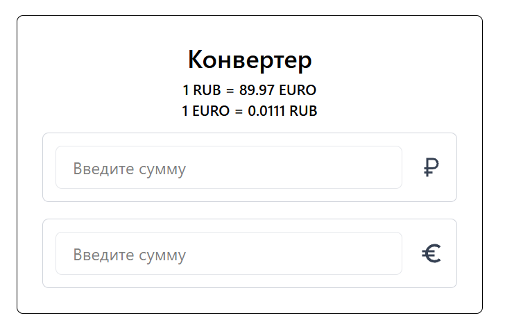
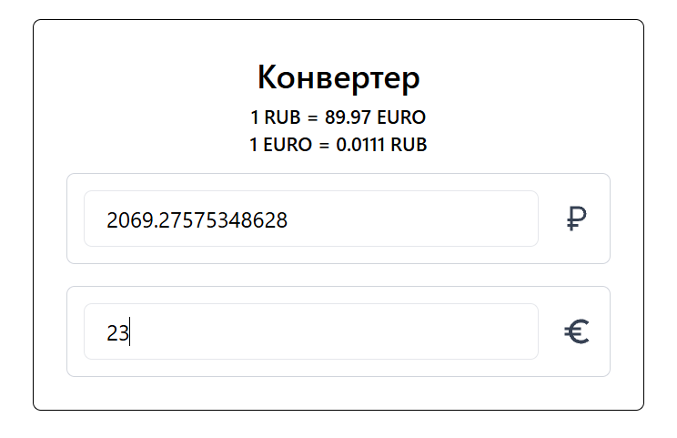

# Конвертер валют

Конвертер валют RUB ⇄ EUR, написанный на **React + Tailwind CSS**, с использованием открытого API.
<div>
  
  
</div>

## Функционал

- Двусторонняя конвертация: RUB ⇄ EUR
- Актуальный курс валют с API
- Адаптивный интерфейс с Tailwind CSS

## Установка и запуск

```bash
git clone https://github.com/oryx3422/practic-React-Tailwind.git
cd practic-React-Tailwind/vite-project

npm install
npm run dev
```
